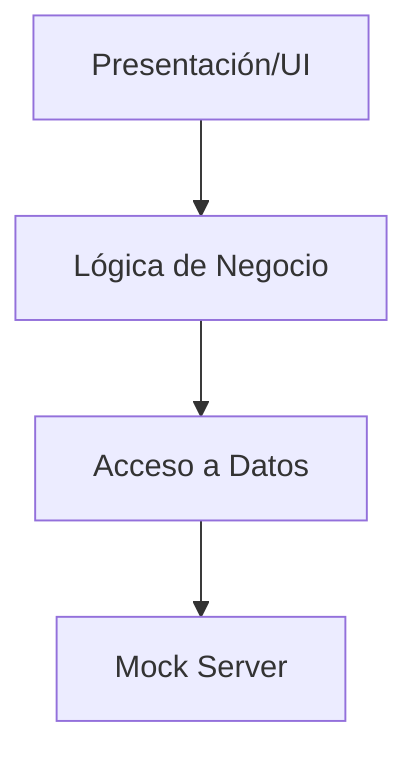
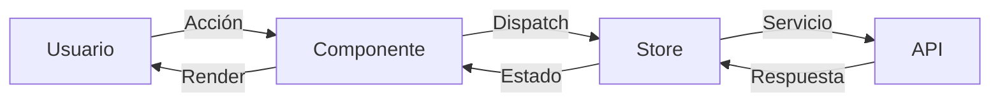

# 🏗️ Arquitectura de D&M Cosplay Heroes

## Índice
- [Visión General](#visión-general)
- [Principios de Diseño](#principios-de-diseño)
- [Estructura de Carpetas](#estructura-de-carpetas)
- [Patrones y Decisiones](#patrones-y-decisiones)
- [Flujo de Datos](#flujo-de-datos)
- [Gestión del Estado](#gestión-del-estado)
- [Consideraciones Técnicas](#consideraciones-técnicas)

## Visión General

D&M Cosplay Heroes utiliza una arquitectura modular basada en características (feature-based architecture) siguiendo los principios de diseño de Angular 18. La aplicación está construida siguiendo el patrón Signal para la gestión del estado, aprovechando las últimas características de Angular.

### Capas de la Aplicación



## Principios de Diseño

1. **Modularidad**
   - Cada característica es un módulo independiente
   - Componentes autónomos y reutilizables
   - Lazy loading para optimización de carga

2. **Reactividad**
   - Uso de Signals para estado local
   - RxJS para flujos de datos asíncronos
   - Gestión de estado predecible

3. **Separación de Responsabilidades**
   - Componentes para la UI
   - Servicios para lógica de negocio
   - Store para gestión de estado
   - Modelos para tipado de datos

## Estructura de Carpetas

```
src/
├── app/
│   ├── core/                    # Núcleo de la aplicación
│   │   ├── interceptors/       # Interceptores HTTP
│   │   ├── models/            # Interfaces y tipos
│   │   └── services/          # Servicios principales
│   ├── features/               # Módulos de características
│   │   └── heroes/           # Módulo de héroes
│   │       ├── components/   # Componentes específicos
│   │       └── pages/       # Páginas/Rutas
│   ├── shared/                 # Recursos compartidos
│   │   ├── components/       # Componentes comunes
│   │   └── directives/      # Directivas
│   └── app.component.ts        # Componente raíz
```

## Patrones y Decisiones

### Patrón Signal
Utilizamos el nuevo sistema de Signals de Angular para gestionar el estado:

```typescript
export class HeroStore {
  // Estado privado
  private state = signal<HeroState>({
    heroes: [],
    selectedHero: null,
    loading: false,
    error: null
  });

  // Selectores públicos
  heroes = computed(() => this.state().heroes);
  selectedHero = computed(() => this.state().selectedHero);
}
```

### Patrón Repository
Los servicios actúan como repositorios, encapsulando la lógica de acceso a datos:

```typescript
@Injectable({
  providedIn: 'root'
})
export class HeroService {
  constructor(private http: HttpClient) {}

  getHeroes(filters: HeroFilters): Observable<ApiResponse<Hero[]>> {
    // Implementación
  }
}
```

### Interceptores
Manejo centralizado de aspectos transversales:

```typescript
export const loadingInterceptor: HttpInterceptorFn = (req, next) => {
  // Implementación
};
```

## Flujo de Datos

1. **Entrada de Usuario**
   - Componente captura la acción
   - Dispara evento o llama al store

2. **Procesamiento**
   - Store maneja la acción
   - Ejecuta lógica de negocio
   - Actualiza el estado

3. **Actualización UI**
   - Signals notifican cambios
   - Componentes se actualizan
   - UI refleja nuevo estado



## Gestión del Estado

### Store Central
```typescript
export class HeroStore {
  // Acciones
  loadHeroes(filters?: Partial<HeroFilters>)
  createHero(hero: Omit<Hero, 'id'>)
  updateHero(id: string, hero: Partial<Hero>)
  deleteHero(id: string)

  // Efectos
  private handleError(error: Error)
  private updateCache(heroes: Hero[])
}
```

### Estados Locales
Los componentes mantienen su propio estado cuando es necesario:

```typescript
@Component({/*...*/})
export class HeroFormComponent {
  private formState = signal<FormState>({
    dirty: false,
    valid: false,
    submitted: false
  });
}
```

## Consideraciones Técnicas

### Rendimiento
- Lazy loading de módulos
- Uso de trackBy en listas
- Memoización con signals
- Paginación del lado del servidor

### Seguridad
- Sanitización de datos
- Validación de entrada
- Manejo seguro de rutas

### Mantenibilidad
- Tests unitarios
- Documentación inline
- Código tipado
- Principios SOLID

### Optimizaciones Futuras
- Implementación de PWA
- Server-side rendering
- Caché avanzada
- Internacionalización